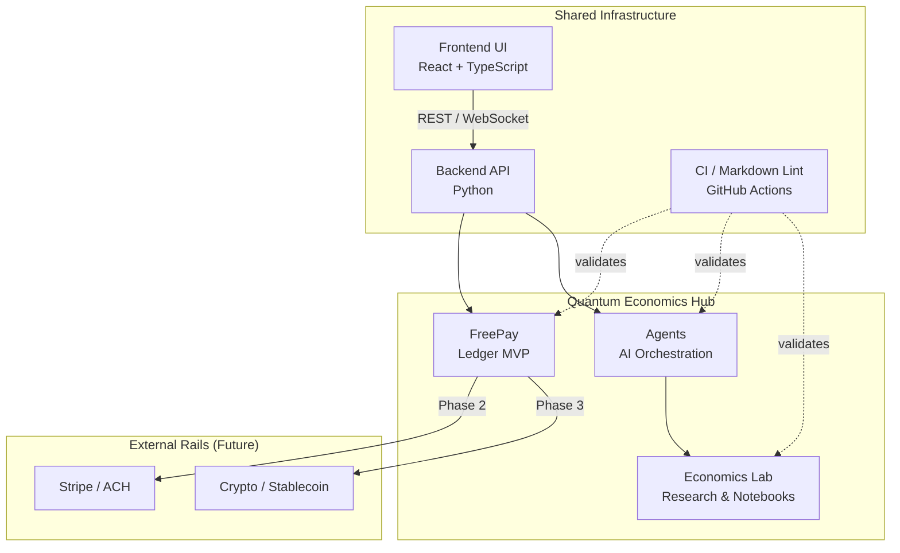

# Architecture

## Overview

The Quantum Economics ecosystem is organized as a **hub monorepo** with three primary project areas that share common infrastructure (CI, documentation standards, and an emerging shared domain library).

---

## High-Level Components

| Component | Location | Responsibility |
|---|---|---|
| **FreePay** | `projects/freepay/` | Ledger, accounts, transactions, payment rails |
| **Agents** | `projects/agents/` | AI agent orchestration, economic analysis tasks |
| **Economics Lab** | `projects/economics-lab/` | Research notebooks, datasets, evaluations |
| **Demos** | `demos/` | Runnable examples that combine the above |
| **Backend (shared)** | `backend/` | Python API server (FastAPI/Flask) |
| **Frontend (shared)** | `frontend/` | React/TypeScript UI shell |

---

## System Diagram



---

## FreePay Architecture

FreePay follows a **clean-architecture** pattern with clearly separated domain, application, and infrastructure layers.

```text
projects/freepay/
├── domain/
│   ├── account.py        # Account entity (id, owner, currency, balance)
│   ├── transaction.py    # Transaction entity (debit, credit, amount, timestamp)
│   └── journal.py        # Journal: collection of balanced transaction pairs
├── application/
│   ├── ledger_service.py # Use cases: open account, post transaction, query balance
│   └── audit_service.py  # Read-only audit trail queries
├── infrastructure/
│   ├── postgres_repo.py  # Postgres persistence (SQLAlchemy)
│   └── in_memory_repo.py # In-memory repo for testing/dev
└── api/
    └── routes.py         # FastAPI route handlers
```

**Key design constraint:** The MVP does NOT move real money. It is a double-entry ledger. Payment rail integrations (Stripe, crypto) are designed as swappable infrastructure adapters in Phase 2.

---

## Agent Architecture

Agents are stateless task executors that consume an input context and produce structured output. They are orchestrated by a lightweight coordinator that handles retries, logging, and human-in-the-loop checkpoints.

```text
projects/agents/
├── coordinator.py        # Task dispatch, retry logic
├── tasks/
│   ├── economic_summary.py   # Summarize economic data
│   ├── ledger_analysis.py    # Analyze FreePay ledger snapshots
│   └── report_generator.py  # Produce structured Markdown reports
└── checkpoints/
    └── human_review.py       # Pause for human approval before consequential actions
```

---

## Data Flow (FreePay MVP)

```text
Client Request
    │
    ▼
FastAPI Route Handler
    │
    ▼
Ledger Application Service
    │  (validates double-entry constraint)
    ▼
Journal Repository
    │  (persists debit + credit pair atomically)
    ▼
Postgres (or In-Memory for dev)
    │
    ▼
Audit Log (append-only table)
```

---

## Security Considerations

- All API endpoints require authentication (token or session) — no anonymous writes.
- Double-entry constraint is enforced at the application layer, not just the DB.
- Audit log is append-only; updates to past records are rejected.
- No PII stored beyond what is necessary; email is optional in the MVP.
- CI enforces no secrets in committed files.

---

## Future Extension Points

1. **Payment Rails Adapter** — a clean interface in `infrastructure/` that can be swapped from `in_memory_repo` → `stripe_adapter` → `crypto_adapter`.
2. **Agent Autonomy Levels** — parameterized so agents can operate fully autonomously or with mandatory human checkpoints.
3. **Multi-currency Ledger** — domain model supports `currency` field from day one; FX conversion is a Phase 3 concern.
